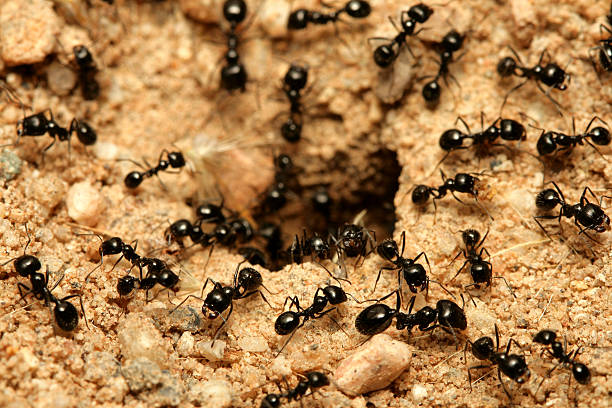

# Antscension
A 2D platformer game made with Unity, where you play as an ant in a colony by platforming, combatting enemies, and avoiding environmental hazards.

## Contributors
- [Sufferal](https://github.com/Sufferal)
- [Syn4z](https://github.com/Syn4z)
- [Grena30](https://github.com/Grena30)
- [danielBctr](https://github.com/danielBctr)

## Setting
The world of Antscension is set deep within a moor, where a hidden ant colony thrives underground. This vast, interconnected network of tunnels and chambers is home to the colony led by a wise and commanding Queen. However, the outside world is full of danger, with rival insect factions, including the powerful Wasp Empire, threatening the colony’s existence. Key characters include Athen, a seemingly insignificant worker ant, the Queen who governs the colony, General Formic, a seasoned soldier ant, and Leaf, a helpful forager. Opposing forces include the Wasp Empress, a cunning ruler with plans to destroy the colony, the Tunnel Snake, a fearsome guardian of the deeper tunnels, and the Moss Beetle King, a rival ant colony leader with his own agenda.